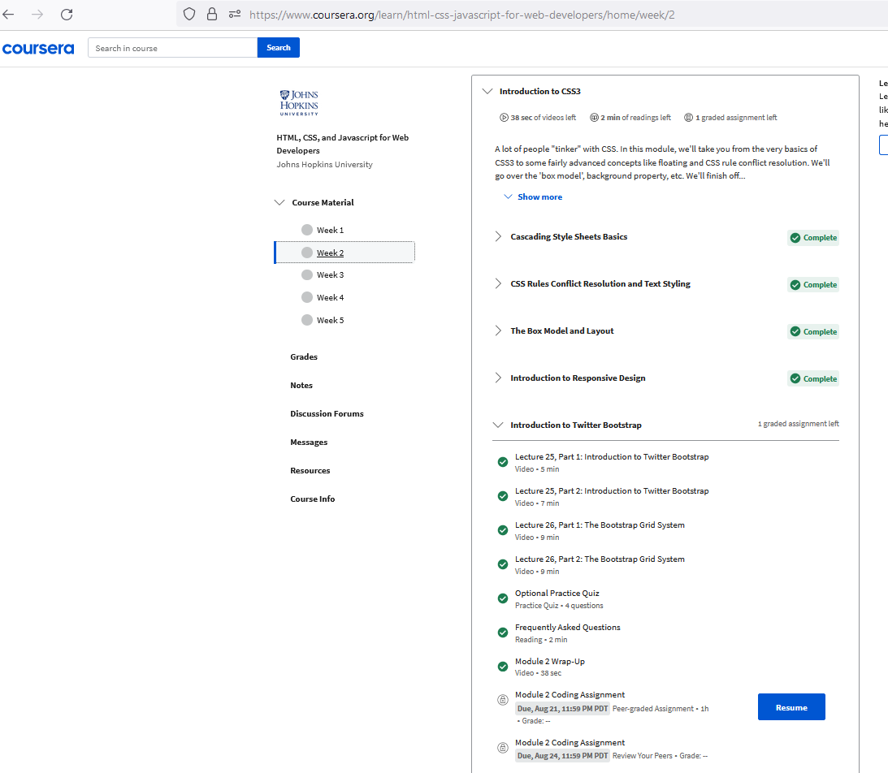

# kottans-frontend
## Linux CLI, and HTTP

    
Linux_Screenshots

## Git Collaboration

    
Git_Screenshots

## Intro to HTML and CSS

    
 html-css Screenshots

  

    

  

  

## Responsive Web Design

    
 flex-grid Screenshots

    

  

  

## HTML-CSS_PopUp
[code](https://github.com/Westerinoo/HTML-CSS_PopUp) |
[Demo](https://westerinoo.github.io/HTML-CSS_PopUp/)
